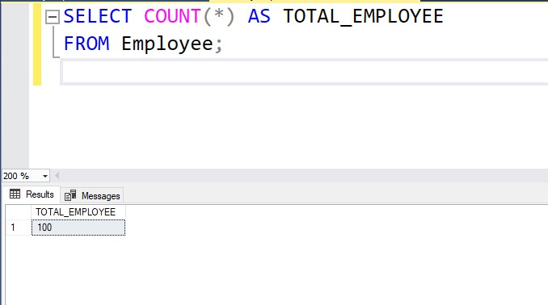

# SQL_Task_3

## Query 1: Total number of employees in the employee table

## Query 2: Top 5 cities with highest number of employees then filter result to show cities with more than 15 employees

## Query 3: Top 1 pincode used the most by employees cities with highest number of employees.

